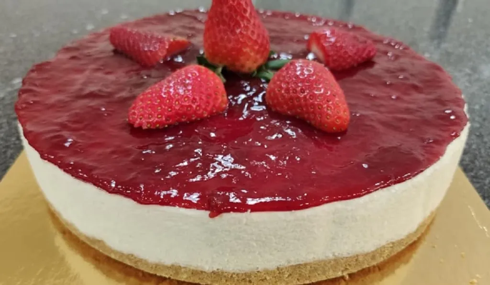

# Cheesecake De Morango

Uma Receita Da Familia **Monteiro**

---

 

## Ingredientes

Base:
-200 g de bolacha digestiva ou Maria
-100 g de manteiga derretida

Recheio:
-400 g de queijo creme (tipo Philadelphia)
-200 ml de natas para bater (bem frias)
-100 g de açúcar
-1 colher de chá de extrato de baunilha
-10 g de gelatina em pó (ou 5 folhas de gelatina)
-50 ml de leite quente
-Cobertura de morango:
-250 g de morangos
-50 g de açúcar
-1 colher de sopa de sumo de limão
-5 g de gelatina em pó (ou 2,5 folhas de gelatina)

---

## Modo de Preparação

-Tritura as bolachas até ficarem em farinha.
-Mistura com a manteiga derretida até obter uma textura de areia molhada.
-Forra o fundo de uma forma de aro removível (20-22 cm) e pressiona bem com uma colher.
-Leva ao frigorífico por pelo menos 30 minutos.
-Hidrata a gelatina em 2 colheres de sopa de água fria por 5 minutos e depois dissolve-a no leite quente.
-Bate o queijo creme com o açúcar e a baunilha até ficar cremoso.
-À parte, bate as natas bem frias até ficarem firmes.
-Junta a gelatina dissolvida ao queijo creme, misturando bem.
-Adiciona as natas batidas, incorporando suavemente.
-Verte essa mistura sobre a base e alisa a superfície.
-Leva ao frigorífico por 4 horas, até firmar.
-Tritura os morangos com o açúcar e o sumo de limão.
-Leva ao lume até ferver, mexendo sempre.
-Hidrata a gelatina em 2 colheres de sopa de água fria e depois dissolve-a na calda quente.
-Deixa arrefecer um pouco e despeja sobre o cheesecake já firme.
-Leva ao frigorífico por mais 2 horas para a cobertura solidificar.
-Desenforma com cuidado e decora com morangos frescos por cima.

