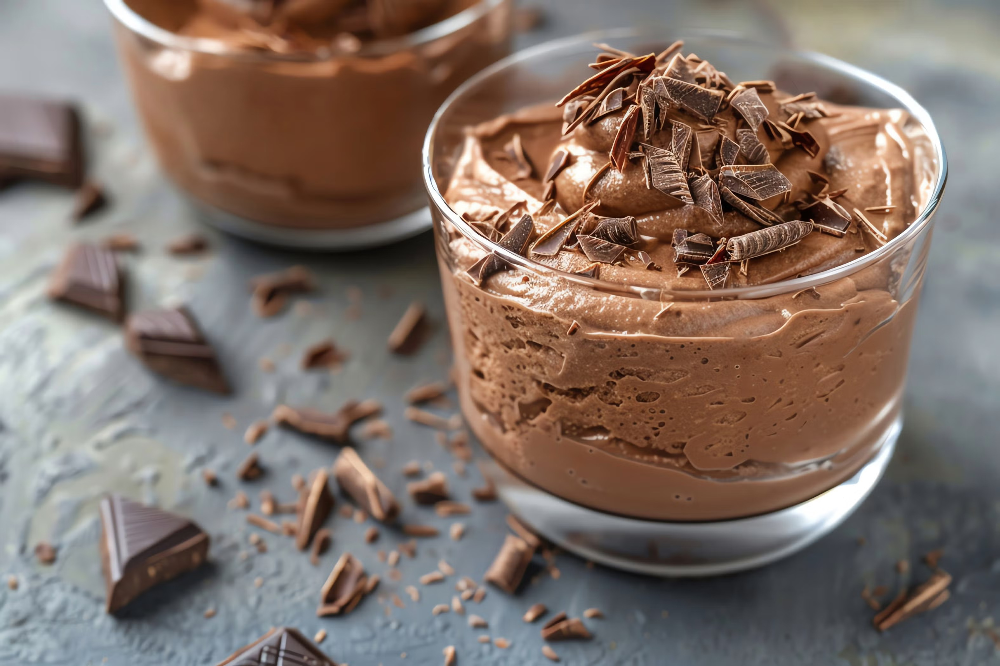

# Mousse de chocolate

Uma receita da família **Martins**

---

## Ingredientes

- 8 ovos
- 200g de margarina 
- 1 tablet de chocolate 70% 
- 8 colheres de sopa de açucar 

---

## Utensílios

- Batedeira  
- Salazar  
- Microondas

---

## Modo de Preparação

### 1. Separação das claras e das gemas
Separar as claras das gemas

### 2. Envolver as claras
Colocar as claras e bater com 3 colheres de açucar.Quando tiverem firmes colocar à parte

### 3. Derreter a manteiga e o chocolate
Derreter a manteiga,juntar o chocolate e envolver.

### 4. Continuar a cozinhar
Bater as cemas com o restante açucar quando estiver esbranquiçada, juntar a mistura com o chocolate e bater mais um pouco.

### 5. Toques finais
Envolver depois nas claras. E por fim empratar

### 7. Servir
Ao servir pode se decorar com umas pitadas de nozes picadas e pimento rosa

---
