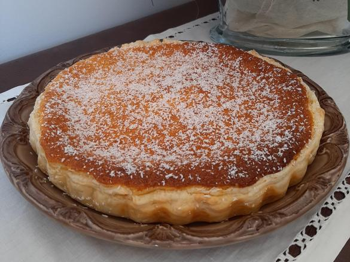

# Tarte de Coco

Uma receita da família **Marques**

---

## Ingredientes

- 8 ovos
- 2 latas de leite condensado
- 2 colheres (sopa) de açúcar
- 200g de coco ralado
- Açúcar em pó q.b (quanto baste) para polvilhar

## Utensílios

- Forno
- Varinha de arame
- Tarteira

## Preparação

Juntar o leite condensado, os ovos, o açúcar e mexer bem com a varinha de arama.

Por fim adicionar o coco ralado e misturar bem.

Barrar com manteiga/margarina a tarteira de pirex e verter o preparado.

Preaquecer o forno a 180º graus.

Levar o preparado ao forno durante 30 minutos, até ficar doradinha.

Tirar do forno, quando estiver fira polvilhar com açúcar em pó e coco ralado.