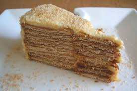

# Bolo de Bolacha

## Bolo de Bolacha

### Ingredientes
- 2 pacotes de bolacha Maria
- 200 g de manteiga (à temperatura ambiente)
- 150–200 g de açúcar
- 1 chávena de café forte (frio)
- Bolacha Maria triturada (para decorar)

### Utensílios
- Taça grande
- Batedeira ou colher de pau
- Prato ou travessa
- Taça pequena para o café

### Modo de Preparação

#### 1. Preparar o café
Faz uma chávena de café forte e deixa arrefecer numa taça.

#### 2. Fazer o creme
Numa taça grande, bate a manteiga com o açúcar até obteres um creme claro, macio e homogéneo.

#### 3. Molhar as bolachas
Passa cada bolacha Maria rapidamente pelo café frio.  
Não deixes muito tempo para evitar que se desfaçam.

#### 4. Montar o bolo
Coloca uma camada de bolachas num prato ou travessa.  
Cobre com uma camada de creme de manteiga.

Repete o processo:
- camada de bolachas
- camada de creme

Continua até terminares os ingredientes.

#### 5. Finalizar
Cobre o topo do bolo com mais creme e polvilha com bolacha Maria triturada.

#### 6. Refrigerar
Leva o bolo ao frigorífico durante pelo menos **3 a 4 horas** antes de servir.  
Idealmente deixa **uma noite inteira** para ganhar melhor consistência.

### Servir
Serve o bolo de bolacha bem fresco.

### Notas
- Se preferires um sabor mais suave, podes molhar as bolachas em leite em vez de café.
- O bolo fica mais firme e saboroso no dia seguinte.